# Leoessential Studio & Academy — Technical Architecture

## 1. Architectural Overview & Design Philosophy

Leoessential is built as a high-performance, responsive React single-page application (SPA) with Vite and Tailwind CSS. The architecture prioritizes:
- **Instantaneous Page Loads & Zero Bloat:** Minimal runtime overhead, clean semantic markup, and optimized media containers.
- **Strict Separation of Concerns:** Service tiers, policies, product data, and studio metadata are abstracted into strongly-typed TypeScript data modules.
- **Progressive Disclosure:** Complex treatments, refill eligibility criteria, and training curricula are revealed through frictionless modal views, interactive tabs, and accordions.
- **Frictionless Booking Handoff:** Direct integration hooks into **Square Appointments** with pre-configured parameters, complemented by instant WhatsApp concierge routing.

---

## 2. Directory Layout

```
leoessential-studio/
├── CONTEXT.md                  # Business overview, target personas, operational rules
├── ARCHITECTURE.md             # System design, component hierarchy, integration hooks
├── DESIGN_SYSTEM.md            # Palette tokens, typography, spacing, UI patterns
├── package.json                # Project dependencies and npm scripts
├── tsconfig.json               # TypeScript compiler options
├── vite.config.ts              # Vite bundle configuration
├── index.html                  # HTML entrypoint with preconnected fonts & meta tags
└── src/
    ├── main.tsx                # React DOM root entry
    ├── index.css               # Core CSS, font declarations, glassmorphism utilities
    ├── types/                  # Core domain TypeScript interfaces
    │   ├── service.ts          # ServiceItem, ServiceCategory, RefillRule
    │   ├── product.ts          # RetailProduct, RetailCategory
    │   ├── policy.ts           # StudioPolicy, SeverityLevel
    │   └── academy.ts          # AcademyCourse, SyllabusItem
    ├── data/                   # Decoupled content & pricing matrices
    │   ├── studio.ts           # Contact constants, social links, opening hours
    │   ├── services.ts         # Lashes & brows menu with dual NGN/USD pricing
    │   ├── products.ts         # In-studio pickup retail catalog items
    │   ├── policies.ts         # 6 core studio policies with full details
    │   └── academy.ts          # 1:1 masterclass tiers & kit inclusions
    ├── components/
    │   ├── layout/
    │   │   ├── Header.tsx             # 3-zone sticky navigation with currency toggle
    │   │   ├── MobileDrawer.tsx       # Slide-over navigation menu
    │   │   ├── MobileStickyBar.tsx    # Bottom quick-action bar with safe-area padding
    │   │   └── Footer.tsx             # Studio credentials, legal, and social links
    │   ├── common/
    │   │   ├── CurrencyToggle.tsx     # NGN / USD switcher
    │   │   ├── ImageWithSkeleton.tsx  # Blur-up placeholder & category fallback badge
    │   │   ├── Toast.tsx              # Transient feedback for copy/form events
    │   │   └── Modal.tsx              # Accessible dialog with ESC listener & focus lock
    │   ├── hero/
    │   │   ├── HeroSection.tsx        # Editorial headline, dual CTAs, trust metrics
    │   │   └── FeatureStrip.tsx       # 3 core studio disciplines & hygiene badges
    │   ├── services/
    │   │   ├── ServiceCatalog.tsx     # Tabbed service browser (Lashes, Brows, Academy, Retail)
    │   │   ├── ServiceCard.tsx        # High-density service card with price & duration
    │   │   ├── ServiceModal.tsx       # Detailed treatment breakdown & prep rules
    │   │   └── StyleFinderQuiz.tsx    # Interactive 3-step recommendation tool
    │   ├── academy/
    │   │   ├── AcademySection.tsx     # Mentorship overview & live model syllabus
    │   │   ├── StudentKitCard.tsx     # Physical kit breakdown (tweezers, glue, tiles)
    │   │   └── EnrollmentModal.tsx    # Lead-capture intake modal with direct routing
    │   ├── retail/
    │   │   ├── RetailGrid.tsx         # In-studio pickup showcase
    │   │   └── ReserveModal.tsx       # 1-click WhatsApp reserve generator
    │   ├── policies/
    │   │   └── PoliciesAccordion.tsx  # Interactive policy disclosures
    │   ├── reviews/
    │   │   └── Testimonials.tsx       # Verified client experiences & graduate reviews
    │   └── contact/
    │       ├── ContactMatrix.tsx      # Phone, WhatsApp, Email, Instagram direct links
    │       ├── OperatingHours.tsx     # Weekly schedule with VIP Sunday notice
    │       └── SquareBookingCard.tsx  # Prominent reservation anchor with checklist
    └── App.tsx                 # Root application assembling layout and sections
```

---

## 3. Component Hierarchy

```mermaid
graph TD
    App[App Container] --> Header[Header / Sticky Navigation]
    App --> MobileDrawer[Mobile Navigation Drawer]
    App --> Hero[Hero Section & Editorial Frame]
    App --> FeatureStrip[Feature Discipline Strip]
    App --> StyleFinder[Style Finder Quiz Tool]
    App --> Philosophy[01. Philosophy & Hygiene Charter]
    App --> Services[02. Service & Treatment Catalog]
    App --> Academy[03. 1:1 Mentorship Academy]
    App --> Policies[04. Studio Policies & Boundaries]
    App --> Testimonials[Client Praise & Social Proof]
    App --> Contact[05. Connect & Instant Reservation]
    App --> Footer[Footer]
    App --> MobileSticky[Mobile Sticky Action Bar]
    App --> ServiceModal[Service Detail Modal]
    App --> ReserveModal[Retail Reserve Modal]
    App --> Toast[Toast Notification]

    Services --> ServiceCard
    Services --> RetailGrid
    Academy --> StudentKitCard
    Policies --> PoliciesAccordion
```



---

## 4. State Management Strategy

The application maintains a centralized, reactive local state using React hooks:

| State Variable | Type | Purpose |
|---|---|---|
| `currency` | `'NGN' \| 'USD'` | Toggles dynamic price formatting throughout the entire site |
| `activeCategory` | `'lashes' \| 'brows' \| 'training' \| 'retail'` | Controls active tab in the catalog |
| `selectedService` | `ServiceItem \| null` | Controls treatment detail modal state |
| `selectedProduct` | `RetailProduct \| null` | Controls retail reservation drawer state |
| `openPolicyId` | `number \| null` | Tracks currently expanded policy accordion |
| `mobileMenuOpen` | `boolean` | Controls mobile slide-over drawer visibility |
| `toastMessage` | `string \| null` | Global toast notification text |

---

## 5. Third-Party Integrations & Booking Pipeline

### A. Square Appointments
- **Target URL:** `https://square.site/book/leoessential`
- **Behavior:** All booking buttons trigger new-tab navigation with security attributes (`rel="noopener noreferrer"`).
- **Service Deep Parameters:** Service cards append category parameters or service intent where supported to streamline appointment selection.

### B. WhatsApp Concierge Pipeline
- **Target URL:** `https://wa.me/2348145356053`
- **Dynamic Pre-Filled Inquiries:**
  - *Academy Mentorship:* `Hi Adedoyin, I would like to apply for the Leoessential 1:1 Masterclass. Could you share upcoming cohort dates?`
  - *Retail Reservation:* `Hi Adedoyin, I would like to reserve [Product Name] for in-studio pickup during my upcoming appointment.`
  - *General Inquiry:* Direct link with polite greeting.

### C. Instagram Direct Link
- **Target URL:** `https://instagram.com/Leo_essential` (`@Leo_essential`)
- Displays real-time social proof and visual set demonstrations.
