# Leoessential Studio & Academy — Technical Architecture

## 1. Architectural Overview & Design Philosophy

Leoessential is built as a high-performance, responsive React single-page application (SPA) with Vite, Tailwind CSS, and Motion. The application serves as the digital flagship for **Leoessential**, a high-end studio specializing exclusively in bespoke lash extensions and accredited 1:1 professional lash mentorship.

### Core Architectural Mandates:
- **Exclusive Lash Specialization:** The architecture and data schemas are strictly tailored to bespoke lash extension styling, follicle health preservation, refills, and lash academy mentorship. **Nail services are strictly excluded.**
- **Instantaneous Page Loads & Zero Bloat:** Minimal runtime overhead, clean semantic markup, and optimized media containers with cross-browser backdrop blur.
- **Strict Separation of Concerns:** Lash service tiers, policies, product data, and studio metadata are abstracted into strongly-typed TypeScript data modules.
- **Frictionless Booking Handoff:** Direct integration hooks into **Square Appointments** with pre-configured parameters, complemented by instant WhatsApp concierge routing.

---

## 2. Directory Layout

```
leoessential-studio/
├── CONTEXT.md                  # Business overview, target personas, operational rules (Lash Focus)
├── ARCHITECTURE.md             # System design, component hierarchy, integration hooks
├── DESIGN_SYSTEM.md            # Palette tokens, typography, spacing, UI patterns
├── package.json                # Project dependencies and npm scripts
├── tsconfig.json               # TypeScript compiler options
├── vite.config.ts              # Vite bundle configuration
├── index.html                  # HTML entrypoint with preconnected fonts & brand favicon
├── public/
│   └── logos/                  # Static brand assets (vector SVG, PNG, icons)
│       ├── leoessential-vector-logo.svg
│       └── leoessential-png-logo.png
└── src/
    ├── main.tsx                # React DOM root entry
    ├── index.css               # Core CSS, font declarations, glassmorphism utilities
    ├── types/                  # Core domain TypeScript interfaces
    │   ├── index.ts            # HeroSlide, ServiceItem, RetailItem, PolicyItem
    ├── data/                   # Decoupled content & pricing matrices
    │   ├── studio.ts           # Contact constants, social links, logo references
    │   ├── carousel.ts         # High-resolution lash editorial showcase slides
    │   ├── services.ts         # Lash extension menu with dual NGN/USD pricing
    │   ├── products.ts         # In-studio lash aftercare retail catalog items
    │   ├── policies.ts         # 6 core studio policies with full details
    │   ├── academy.ts          # 1:1 lash masterclass tiers & kit inclusions
    │   └── reviews.ts          # Verified client testimonials & graduate reviews
    ├── components/
    │   └── HeroCarousel.tsx    # Cinematic full-bleed lash carousel with fixed frosted navbar
    ├── utils/
    │   └── currency.ts         # Dual NGN/USD currency utilities
    └── App.tsx                 # Root application assembling layout, navigation, and sections
```

---

## 3. Component Hierarchy

```mermaid
graph TD
    App[App Container] --> Header[Fixed Frosted Header / Navigation]
    App --> MobileDrawer[Mobile Navigation Drawer with Monogram]
    App --> HeroCarousel[Hero Editorial Lash Showcase Carousel]
    App --> Philosophy[01. Philosophy & Safety Charter + Founder Card]
    App --> Services[02. Curated Lash Menu & Retail Catalog]
    App --> Academy[03. 1:1 Professional Lash Academy]
    App --> Policies[04. Studio Policies & Boundaries Accordion]
    App --> Testimonials[Client Praise & Verified Reviews]
    App --> Contact[05. Connect & Instant Square Reservation]
    App --> Footer[Footer with Brand Insignia]
    App --> MobileSticky[Mobile Quick-Action Booking Bar]
    App --> ServiceModal[Lash Treatment Detail Modal]
    App --> Toast[Toast Notification]

    Services --> ServiceCards[Lash Treatment Cards]
    Services --> RetailGrid[Lash Aftercare Retail Items]
    Academy --> KitCard[Accredited Student Kit Card]
    Policies --> AccordionItems[Policy Accordion Disclosures]
```



---

## 4. State Management Strategy

The application maintains a centralized, reactive local state using React hooks:

| State Variable | Type | Purpose |
|---|---|---|
| `isScrolled` | `boolean` | Dynamically adapts header frosted glass from carousel overlay to page scroll |
| `activeTab` | `'lashes' \| 'brows' \| 'training' \| 'retail'` | Controls active tab in the catalog |
| `selectedServiceForModal` | `ServiceItem \| null` | Controls treatment detail modal state |
| `openPolicyId` | `number \| null` | Tracks currently expanded policy accordion item |
| `mobileMenuOpen` | `boolean` | Controls mobile slide-over drawer visibility |
| `toastMessage` | `string \| null` | Global toast notification text |

---

## 5. Third-Party Integrations & Booking Pipeline

### A. Square Appointments
- **Target URL:** `https://square.site/book/leoessential`
- **Behavior:** All booking buttons trigger new-tab navigation with security attributes (`rel="noopener noreferrer"`).
- **Primary CTAs:** Floating hero segmented pill, fixed navigation bar, and bottom mobile bar.

### B. WhatsApp Concierge Pipeline
- **Target URL:** `https://wa.me/2348145356053`
- **Dynamic Pre-Filled Inquiries:**
  - *Academy Mentorship:* `Hi Adedoyin, I would like to apply for the Leoessential 1:1 Lash Masterclass. Could you share upcoming cohort dates?`
  - *Lash Aftercare Retail Reservation:* `Hi Adedoyin, I would like to reserve [Product Name] for in-studio pickup during my upcoming appointment.`
  - *Direct Advisory:* Direct link with polite greeting.

### C. Instagram Direct Link
- **Target URL:** `https://instagram.com/Leo_essential` (`@Leo_essential`)
- Displays real-time portfolio, lash map breakdowns, and studio sanctuary atmosphere.
